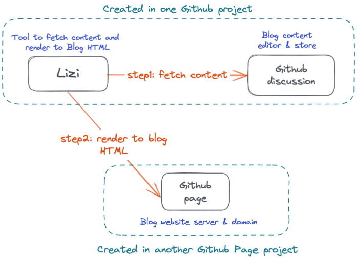
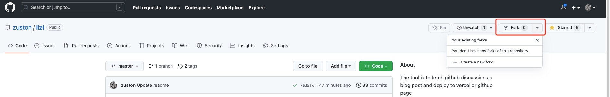
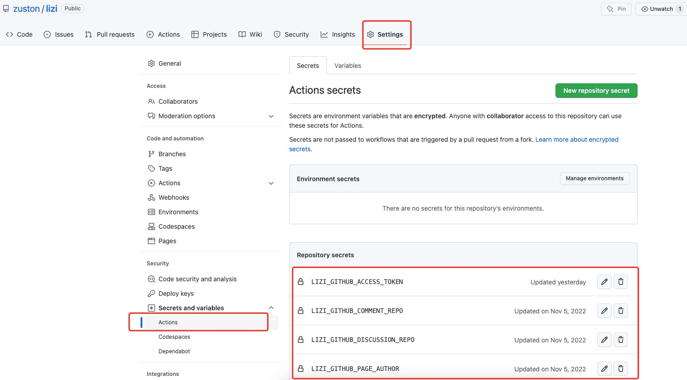
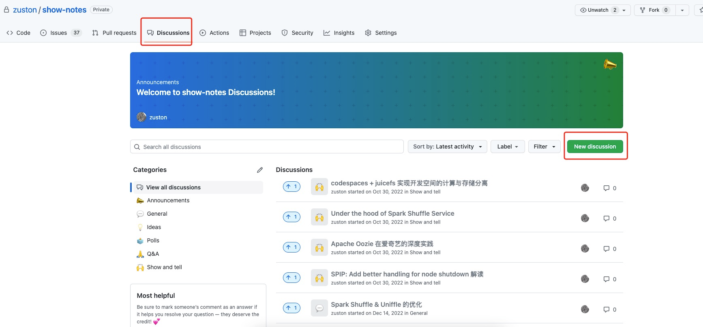
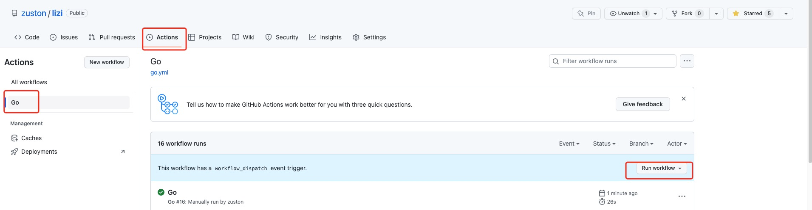

# Lizi

This project is to fetch the Github discussion content as blog post and then publish 
them as a blog via Github page website to visit. That means there is no pay to host or deploy
blog website by reusing the Github page and is simple to write your self blog content by reusing 
the markdown editor from Github discussion.

If you have any questions, feel free to raise an issue to discuss more.

### Example
My blog site is built by this project: http://zuston.github.io

### Motivation

Everyone wants to own their self blog to record life or thoughts, but not everyone has some knowledge to 
build and deploy it. As we know, the existing blog tools like Huge or Jekyll are too complex for regular people.
If it is, this project is developed for you. 

The second reason is to use free resource to deploy from Github provided, no need to purchase domain name and machine resources.

### Architecture

Lizi will fetch discussion's content as blog content and render to blog html according to its built-in blog template.

### Quick start

According to above architecture picture, we know we need to create two github project to execute some code, I call them content
project and website project.

#### Create content project
Please follow the below steps
1. Click the lizi project to fork as your self project, because the fetch trigger has been integrated into its Github action script.
And then you will have your self lizi project.
   
2. Configure some environment vars for lizi to get auth to operate your other projects. Vars are needed as follows
   * LIZI_GITHUB_ACCESS_TOKEN (access token, this should gotten from your personal setting)
   * LIZI_GITHUB_COMMENT_REPO (comment stored project)
   * LIZI_GITHUB_DISCUSSION_REPO (content project name)
   * LIZI_GITHUB_PAGE_AUTHOR (your real name)
   * LIZI_GITHUB_PAGE_EMAIL (your email)
   * LIZI_GITHUB_PAGE_ENABLED (true)
   * LIZI_GITHUB_PAGE_REPO (website project name)
   * LIZI_GITHUB_USER_NAME (your name)
   

#### Create website project
Please refer https://pages.github.com/ to create your own website project. 
(This project name should be configured in above env vars. like LIZI_GITHUB_PAGE_REPO=github.com/zuston/zuston.github.io.git)

#### Try to write blog
1. Create a discussion in your content project and write something.
   

2. Trigger lizi Github action to render blog content. Please fill "x" in the required field .
   

3. Visit your website link after 10sec, link: __[username].github.io__ (like zuston.github.io)
## Roadmap
- [x] Support blog comment 
- [x] Support specific label/category to decide whether to publish
- [x] Support github page
- [x] Provide the github-action to trigger the github-page deploy
- [x] Support dark mode of basic template
- [ ] Customize the publishing data
- [ ] Support producing artifact by github workflow action
- [ ] Support github issue as blog content
- [ ] Support pluggable blog template (__High priority__)
- [ ] Add the deployment document
- [x] Support list semantics of markdown from Github